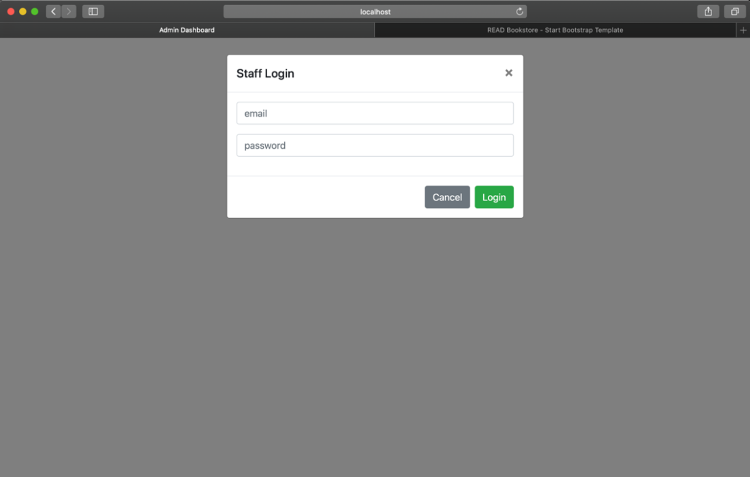
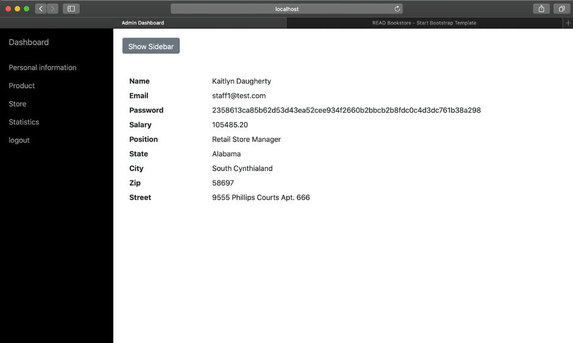
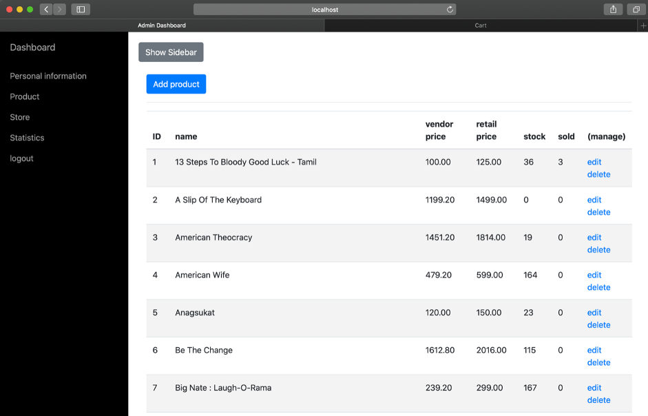
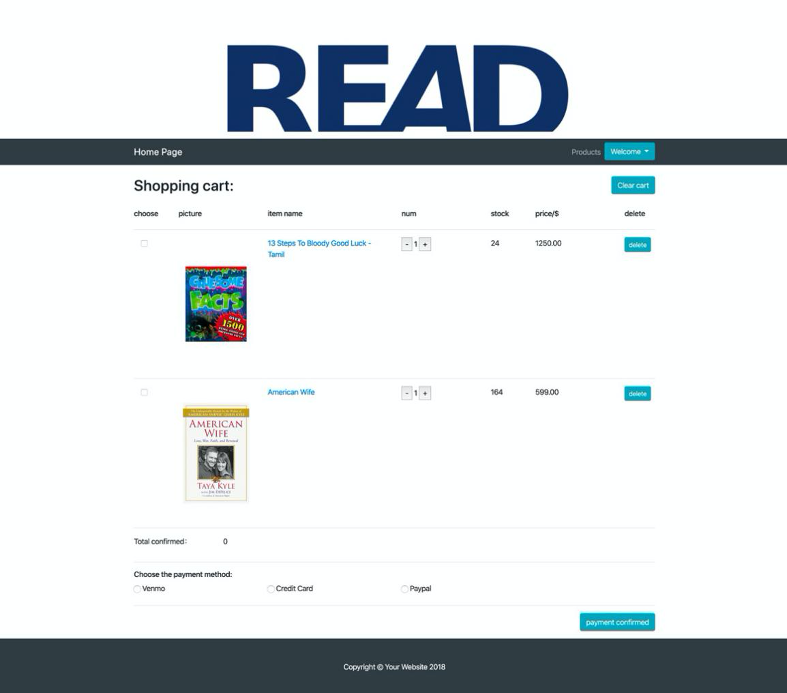
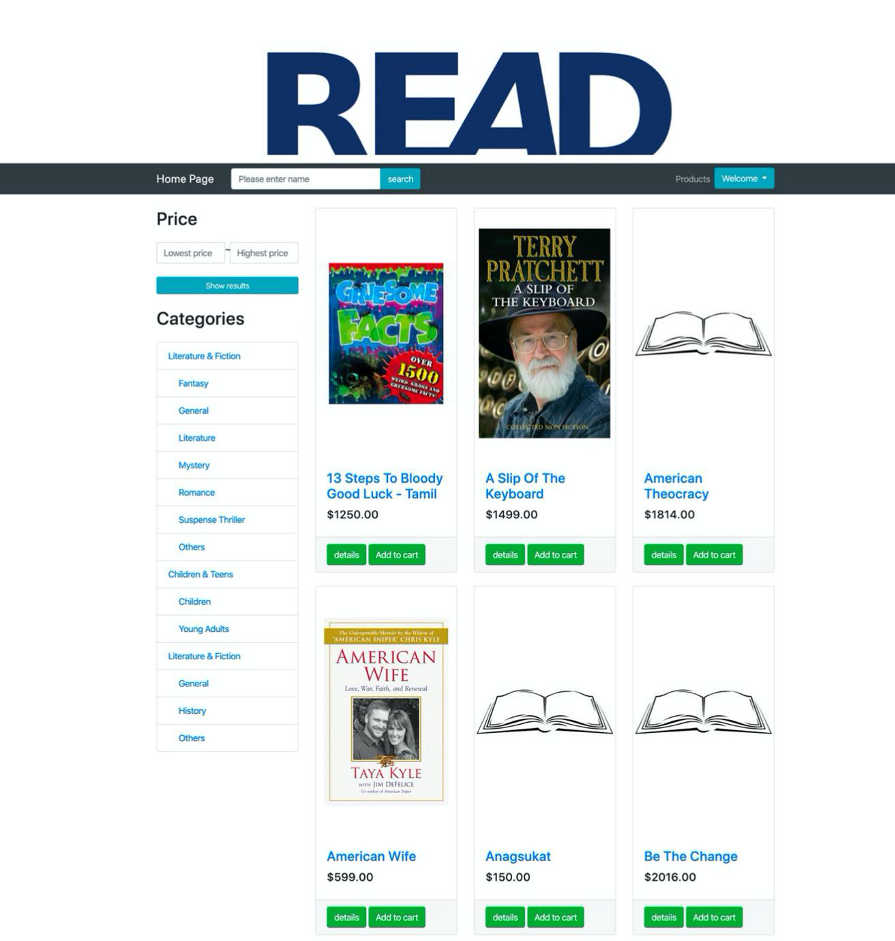
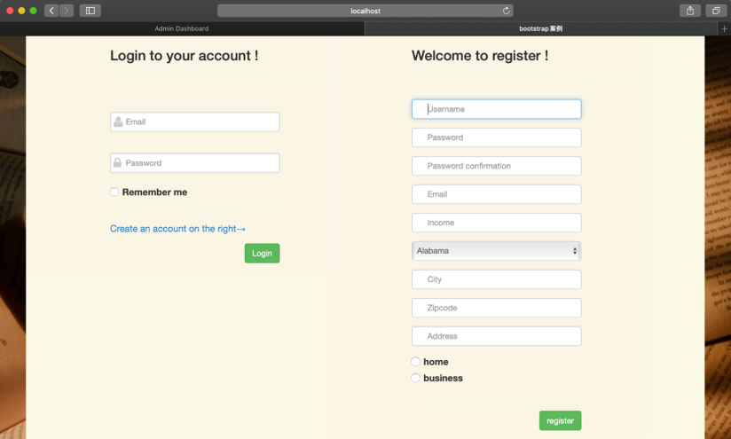
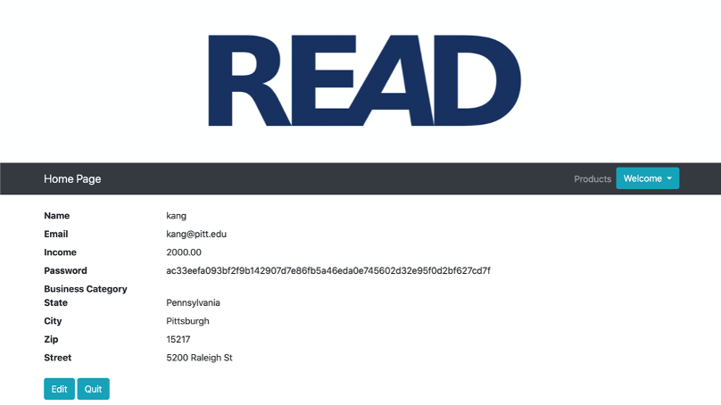
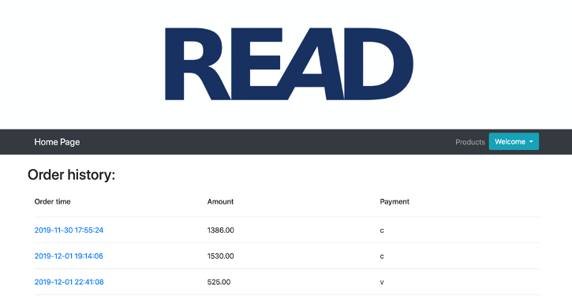

# Online Book Store
Project for Database Manager System via SQL

- *Admin Login:* 
    

- *Admin:* 
    
    
- *Admin Product:* 
    
    
- *Homepage:* 
    
    
- *Cart:* 
    
    
- *Books:* 
    
    
- *Customer Login:* 
    
    
- *Customer Info:* 
    
    
- *Customer Order:* 
    
