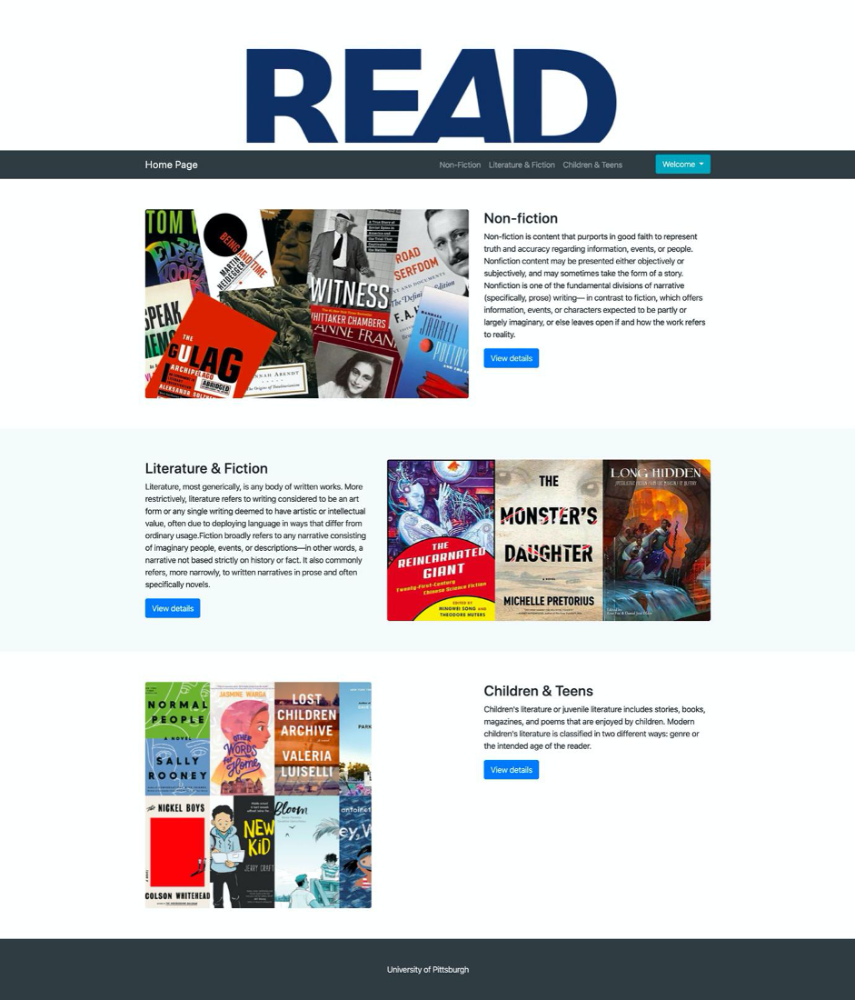

# Online Book Store
Project for Database Manager System via SQL

## Description

The database system for e-commerce “READ”, a book sales company, is designed to provide customers in the United States with convenient online shopping experience. This online bookstore mainly provides three categories of books including Non-fiction, Literature & Fiction and Children & Teens.

The database management system accepts two major types of users: customers and staffs. Customers can be divided into home customers and business customers. All staffs are administrators of the online bookstore and can edit all information of the products. 

Users can browse the system in three ways: 

-	Anonymous customers can browse the online bookstore, but cannot add products to shopping cart, or purchase. 

-	Registered and logged-in customers can browse the system, add products to cart, modify cart, make payment, and review transaction history. 

-	Staffs can check, add, edit, and delete products, view certain statistics about the system.

## Screenshot

- *Admin Login:* 
    

- *Admin:* 
    
    
- *Admin Product:* 
    
    
- *Homepage:* 
    
    
- *Cart:* 
    
    
- *Books:* 
    
    
- *Customer Login:* 
    
    
- *Customer Info:* 
    
    
- *Customer Order:* 
    
